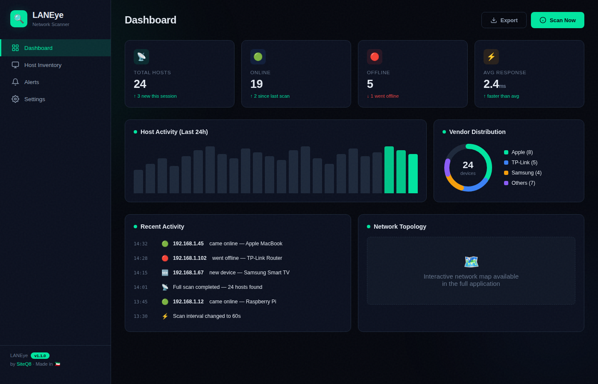
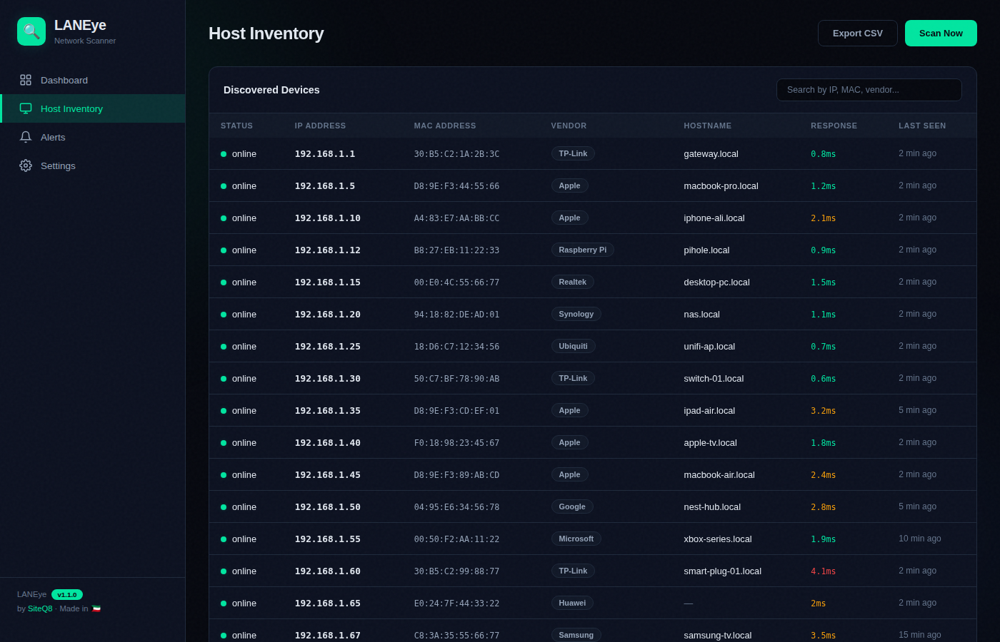
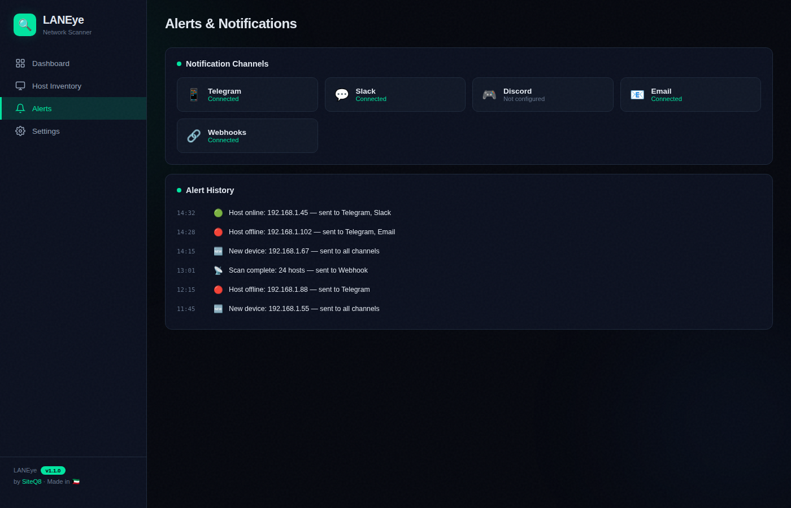

<div align="center">

# 🔍 LANEye

### Lightweight Network IP Scanner with Web GUI

[](https://opensource.org/licenses/MIT)
[](https://www.python.org/downloads/)
[](https://fastapi.tiangolo.com)
[](https://hub.docker.com)
[](http://makeapullrequest.com)

**Real-time host discovery · Inventory management · Multi-channel alerts · ELK/Grafana integration**

[**Live Demo**](https://siteq8.github.io/LANEye) · [**Documentation**](https://siteq8.github.io/LANEye/) · [**Report Bug**](https://github.com/SiteQ8/LANEye/issues) · [**Request Feature**](https://github.com/SiteQ8/LANEye/issues)

</div>

---

## 📸 Screenshots

<div align="center">

### Dashboard


### Host Inventory


### Alerts & Notifications


</div>

---

## ✨ Features

| Feature | Description |
|---------|-------------|
| 🔎 **ARP + ICMP Scanning** | Layer 2 & Layer 3 host discovery with vendor identification via OUI lookup |
| 📋 **Host Inventory** | Persistent SQLite database tracking IP, MAC, vendor, hostname, and status history |
| 🔔 **Smart Notifications** | Alerts for new devices, online/offline changes via Telegram, Slack, Discord, Email, Webhooks |
| 📊 **ELK Stack Integration** | Export scan data to Elasticsearch for Kibana dashboards |
| 📈 **Prometheus + Grafana** | Built-in `/metrics` endpoint for real-time Grafana monitoring |
| 🌐 **Modern Web GUI** | Responsive React dashboard with real-time WebSocket updates |
| 🐳 **Docker Ready** | One-command deployment with `docker-compose` |
| ⚡ **REST API** | Full CRUD API with filtering, sorting, and CSV/JSON export |
| 🔌 **WebSocket** | Live push updates to connected clients on every scan |
| 🏗️ **Rate Limiting** | Configurable probe delays to avoid triggering IDS/IPS |

---

## 🚀 Quick Start

### Docker (Recommended)

```bash
git clone https://github.com/SiteQ8/LANEye.git
cd LANEye
docker-compose up -d
```

Access the web interface at **http://localhost:8000**

### With Monitoring Stack

```bash
# Includes Prometheus + Grafana
docker-compose --profile monitoring up -d
```

### Manual Installation

```bash
# Prerequisites: Python 3.9+, libpcap
sudo apt install libpcap-dev

pip install -r requirements.txt

# Run (requires root for ARP scanning)
sudo uvicorn main:app --host 0.0.0.0 --port 8000
```

---

## ⚙️ Configuration

Edit `config.yaml` to configure scanning, notifications, and integrations:

```yaml
scanning:
  interface: eth0
  subnet: 192.168.1.0/24
  interval: 60              # seconds between scans

notifications:
  enabled: true
  channels:
    - telegram
    - slack
    - webhook
  telegram:
    bot_token: "YOUR_BOT_TOKEN"
    chat_id: "YOUR_CHAT_ID"

elk:
  enabled: false
  elasticsearch_url: http://localhost:9200

grafana:
  enabled: true
  metrics_endpoint: /metrics
```

See the full [config.yaml](config.yaml) for all options.

---

## 🏗️ Architecture

```
┌──────────────────────────────────────────────────────┐
│                   Web Browser                        │
│            (React GUI / WebSocket)                   │
└────────────────────┬─────────────────────────────────┘
                     │ HTTP / WS
┌────────────────────▼─────────────────────────────────┐
│                FastAPI Backend                        │
│  ┌──────────┐  ┌─────────┐  ┌──────────────────┐    │
│  │ REST API │  │   WS    │  │ Background Scan  │    │
│  └────┬─────┘  └───┬─────┘  └───────┬──────────┘    │
│       └─────────────┼────────────────┘               │
│  ┌──────────────────▼────────────────────────┐       │
│  │         Scanner (ARP + ICMP + OUI)        │       │
│  └──────────────────┬────────────────────────┘       │
│  ┌────────┐  ┌──────▼─────┐  ┌────────────────┐     │
│  │ SQLite │  │ Notifier   │  │   Exporters    │     │
│  │   DB   │  │ TG/Slack/… │  │ ELK/Prom/Influx│     │
│  └────────┘  └────────────┘  └────────────────┘     │
└──────────────────────────────────────────────────────┘
```

---

## 📡 API Endpoints

| Method | Endpoint | Description |
|--------|----------|-------------|
| `GET` | `/api/hosts` | List all discovered hosts (filter by `?status=online&vendor=Apple`) |
| `GET` | `/api/hosts/{ip}` | Get details for a specific host |
| `POST` | `/api/scan` | Trigger an on-demand network scan |
| `GET` | `/api/stats` | Get scanner statistics |
| `DELETE` | `/api/hosts/{ip}` | Remove a host from inventory |
| `GET` | `/api/export/json` | Export all hosts as JSON |
| `GET` | `/api/export/csv` | Export all hosts as CSV |
| `GET` | `/metrics` | Prometheus metrics endpoint |
| `GET` | `/health` | Health check |
| `WS` | `/ws` | WebSocket for real-time updates |

Full interactive API docs available at **http://localhost:8000/docs** (Swagger UI).

---

## 🔔 Notification Channels

| Channel | Status | Setup |
|---------|--------|-------|
| 📱 Telegram | ✅ Supported | Set `bot_token` and `chat_id` in config |
| 💬 Slack | ✅ Supported | Add webhook URL |
| 🎮 Discord | ✅ Supported | Add webhook URL |
| 📧 Email | ✅ Supported | SMTP configuration |
| 🔗 Webhooks | ✅ Supported | Any HTTP endpoint |

---

## 🆚 Comparison

| Feature | LANEye | Angry IP Scanner | Fing | Nmap |
|---------|--------|-----------------|------|------|
| Web GUI | ✅ | ❌ | ✅ (mobile) | ❌ |
| Real-time monitoring | ✅ | ❌ | ✅ | ❌ |
| Multi-channel alerts | ✅ | ❌ | ❌ | ❌ |
| ELK/Grafana integration | ✅ | ❌ | ❌ | ❌ |
| REST API | ✅ | ❌ | ❌ | ❌ |
| Self-hosted | ✅ | ✅ | ❌ | ✅ |
| Docker support | ✅ | ❌ | ❌ | ✅ |
| Open source | ✅ MIT | ✅ GPL | ❌ | ✅ GPL |
| Lightweight | ✅ | ✅ | ✅ | ❌ |

---

## 📦 Project Structure

```
LANEye/
├── main.py              # FastAPI application + WebSocket + REST API
├── scanner.py           # ARP/ICMP network scanner engine
├── database.py          # Async SQLite with host inventory & history
├── notifications.py     # Multi-channel notification system
├── exporters.py         # ELK, Prometheus, InfluxDB exporters
├── config.yaml          # Configuration file
├── Dockerfile           # Container image
├── docker-compose.yml   # Full stack deployment
├── pyproject.toml       # Python package configuration
├── requirements.txt     # Dependencies
├── tests/               # Unit tests
├── docs/                # GitHub Pages demo + screenshots
│   ├── index.html       # Interactive demo dashboard
│   └── screenshots/     # UI screenshots
├── frontend/            # React frontend source
├── .github/
│   └── workflows/       # CI/CD pipelines
├── architecture.md      # System architecture
├── DEPLOY.md           # Deployment guide
└── SECURITY.md         # Security policy
```

---

## 🧪 Development

```bash
# Install dev dependencies
pip install -e ".[dev]"

# Run tests
pytest tests/ -v

# Lint
ruff check .

# Run locally
sudo uvicorn main:app --reload --host 0.0.0.0 --port 8000
```

---

## 🤝 Contributing

Contributions are welcome! Please feel free to submit a Pull Request. For major changes, please open an issue first to discuss what you would like to change.

1. Fork the project
2. Create your feature branch (`git checkout -b feature/amazing-feature`)
3. Commit your changes (`git commit -m 'Add amazing feature'`)
4. Push to the branch (`git push origin feature/amazing-feature`)
5. Open a Pull Request

---

## 📝 License

Distributed under the **MIT License**. See [LICENSE](LICENSE) for more information.

---

## 👤 Author

**SiteQ8**

- Email: [site@hotmail.com](mailto:site@hotmail.com)
- Website: [3li.info](https://3li.info)
- GitHub: [@SiteQ8](https://github.com/SiteQ8)

---

<div align="center">

**Made with ❤️ in Kuwait 🇰🇼**

⭐ Star this repo if you find it useful!

</div>
